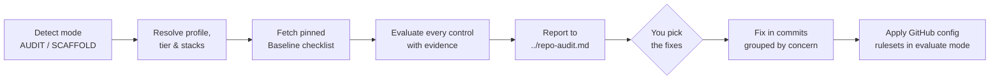

<div align="center">

[](https://github.com/dcotelo/shipshape/actions/workflows/ci.yml)
[](LICENSE)
[](https://baseline.openssf.org/)
[](https://dcotelo.github.io/shipshape/)

</div>

**shipshape** is an agent-executable repository standard: point a coding agent at `AGENTS.md` and it **audits** an existing repository against the [OpenSSF OSPS Baseline](https://baseline.openssf.org/) plus your house policy, or **scaffolds** a new repository to the same standard. All policy lives in YAML — the prompt contains none.

The security control set is the OSPS Baseline; the house rules align with the [OWASP CI/CD Security](https://cheatsheetseries.owasp.org/cheatsheets/CI_CD_Security_Cheat_Sheet.html), [GitHub Actions Security](https://cheatsheetseries.owasp.org/cheatsheets/GitHub_Actions_Security_Cheat_Sheet.html), and [Software Supply Chain Security](https://cheatsheetseries.owasp.org/cheatsheets/Software_Supply_Chain_Security_Cheat_Sheet.html) cheat sheets (SHA-pinned actions, least-privilege workflow tokens, SCM hardening), and the standard adds contributor-side [git client hardening](CONTRIBUTING.md#recommended-local-git-configuration) that platform controls cannot reach.

---

## How it works

| Path | Purpose |
|------|---------|
| `AGENTS.md` | The agent prompt: modes, hard rules, phases. Contains **no policy**. |
| `standard.yml` | All policy: pinned Baseline version, profiles (`public-oss` / `internal`), tiers, house merge/review rules, required files. |
| `stacks/*.yml` | Per-stack rules (Go, TypeScript, Terraform, Atlantis, Docker, shell, agent manuals): detection patterns, required checks, CI status checks. |

The agent resolves profile and tier, fetches the pinned Baseline checklist (never from memory), evaluates every applicable control with evidence, and writes the audit report to `../<repo>-audit.md` — never into the repo tree.

---

## What a run looks like



1. **Detect mode** — repo with commits → AUDIT; empty → SCAFFOLD. Announced, never assumed.
2. **Resolve profile, tier, stacks** — profile is asked every run, never inferred from visibility; stacks are detected from the tree and confirmed.
3. **Fetch the pinned Baseline** — control IDs come from the versioned checklist, verbatim, never from model memory.
4. **Evaluate** — every control records `pass | fail | n/a | not_run` with the file, setting, or command output that decided it. A missing scanner is `not_run`, never `pass`.
5. **Report, then stop** — in AUDIT mode nothing changes until you choose what to fix.
6. **Fix and configure** — separate commits per concern; GitHub rulesets start in `evaluate` enforcement so nothing breaks mid-flight.

The agent never invents a license, security contact, or owner; never makes a repo public; never force-pushes or rewrites history. Those are your decisions — it asks.

---

## Install and run

**As a Claude Code plugin (recommended):**

Install once:

```
/plugin marketplace add dcotelo/shipshape
/plugin install shipshape@shipshape
```

Use in any repository:

```
/shipshape audit      # audit an existing repo
/shipshape scaffold   # scaffold an empty one
```

Update: `/plugin marketplace update shipshape`. The repo is its own single-plugin marketplace — the whole tree installs together, so the standard stays single-source.

**As a symlinked skill (development):**

```sh
git clone https://github.com/dcotelo/shipshape.git ~/dev/shipshape
ln -s ~/dev/shipshape/skills/shipshape ~/.claude/skills/shipshape
```

`git pull` in the clone keeps the skill current.

**Manually:**

1. Clone this repository, or vendor `AGENTS.md`, `standard.yml`, and `stacks/` into the repository you want audited.
2. Ensure the agent's environment has:
   - `git` and an authenticated `gh` CLI (repo settings are checked and applied via the GitHub API),
   - `gitleaks` for secret scanning (a missing tool is recorded `not_run`, never `pass`),
   - network access to `baseline.openssf.org` (the pinned checklist is fetched at the start of every run).
3. Start an agent session in the target repository and instruct it:

   > Read the standard at AGENTS.md and follow it. Audit this repo.

   — or *"Scaffold this repo."* for an empty one.

4. Answer the profile's open questions (license, security contact, owners); the agent evaluates, reports, and fixes only what you approve.

Before first use, fill the placeholders in `standard.yml` (`org.owner`, `shared_workflows_ref`) and edit the `house:` section to taste — it is policy, not standard.

---

## Trying it on a repository you care about

Point it at a mature repository and it will read a great deal and write
nothing. Ask for a dry run:

```
/shipshape audit dry-run
```

or, without the plugin, tell the agent: *"Read the standard at AGENTS.md and
follow it. Dry-run audit this repo."*

A dry run reads the working tree, git history, the GitHub API, and the pinned
Baseline checklist, and it runs whatever read-only scanners are installed. For
the whole run it writes no file, runs no git command that writes, and sends
nothing but reads to the GitHub API. Phase 4 prints the ruleset it would have
applied instead of applying it, and the report goes to stdout, so a dry run
leaves nothing behind. The full contract is the **Dry run** section of
[`AGENTS.md`](AGENTS.md).

The output is the audit report: a header, the counts, a row per control, the
judgment section, and a ranked fix list. Rows carry the evidence that decided
them, and a scanner that is not installed is `not_run`, never a pass.

```text
Profile: public-oss   Tier: 2   Stacks: go, docker, agents
Baseline: <pinned version>        Mode: AUDIT (dry run — nothing written)

pass 31   fail 6   n/a 4   not_run 2

<control-id>  | pass    | .github/workflows/ci.yml pins all actions to SHAs
<control-id>  | fail    | no SECURITY.md; no disclosure contact anywhere
<control-id>  | n/a     | private repo cannot satisfy public readability
<control-id>  | not_run | gitleaks not installed; no secret scan performed
...

Judgment
  README assumes a preconfigured cluster: "just run make deploy" (README.md:64)
  CONTRIBUTING describes a test command that no longer exists ...

Ranked fixes
  1. ...

Not done
  Phase 4 skipped: dry run. Would have created a ruleset with ...
```

Control IDs and counts above are placeholders for shape, not a real audit. The
real ones come from the pinned checklist, verbatim, at run time.

---

## Tests

CI runs `yamllint` over all YAML files, verifies that every path the agent manuals reference exists in the tree, validates the plugin manifests, and lints the scripts. This block is the canonical command list: it is what [`ci.yml`](.github/workflows/ci.yml) runs, and what an agent following [`AGENTS.md`](AGENTS.md) runs. Keep the three in step.

```sh
python3 -m pip install --user yamllint==1.37.1
python3 -m yamllint --strict .
./.github/scripts/check-refs.sh
jq empty .claude-plugin/plugin.json .claude-plugin/marketplace.json
shellcheck .github/scripts/*.sh
```

---

## Working on this repo

- [`AGENTS.md`](AGENTS.md) is the agent operating manual: an agent editing this repository reads it first.
- [`CONTRIBUTING.md`](CONTRIBUTING.md) is for humans: process, DCO sign-off, and the rules for AI-assisted changes.

---

## Contributing

See [CONTRIBUTING.md](CONTRIBUTING.md) — DCO sign-off required. Security issues: [SECURITY.md](SECURITY.md).

<div align="center">

**Maintained by [@dcotelo](https://github.com/dcotelo)** · [dcotelo.dev](https://dcotelo.dev)

</div>


